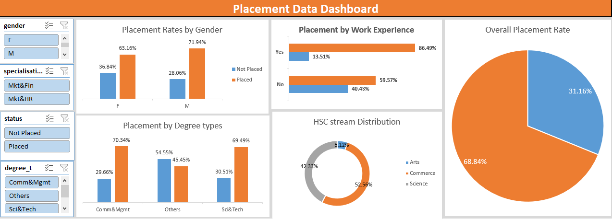

# Placement Data Analysis Project  

This project analyzes placement data to provide actionable insights for improving placement rates and salary packages across various student demographics, degree specializations, and career fields. An Excel dashboard was created to visually showcase key findings and recommendations. And a Powerpoint presentation was developed based on the analysis to showcase the insights.

---

## Objective  

To identify trends and patterns in placement data and recommend strategies to improve employability and placement outcomes for students.

---

## Key Insights & Findings  

### 1. **Encourage Work Experience**  
- **Observation**: Students with internships or part-time work experience achieve higher placement rates and salary packages.  
- **Recommendation**: Promote internships and part-time work opportunities for students.

### 2. **Skill Development for Marketing & HR Students**  
- **Observation**: Marketing & HR students and those with non-traditional degrees have lower placement rates.  
- **Recommendation**: Offer additional training and skill development programs to enhance their employability.

### 3. **Specializations with Better Outcomes**  
- **Observation**: Specializations like Marketing & Finance exhibit better placement rates and salary outcomes.  
- **Recommendation**: Encourage students to consider high-demand specializations to improve their job prospects.

### 4. **Address Gender Gap in Placements**  
- **Observation**: Placement rates for female students are lower compared to male students.  
- **Recommendation**: Ensure equal opportunities and provide tailored career support to bridge the gender gap.

---

## Dashboard Showcase  

Below is an image of the Excel dashboard created for this analysis. It includes visualizations like bar charts, pie charts, and tables to highlight placement trends, salary distributions, and gender-specific data.  

---

## Features of the Dashboard  

- **Placement Trends**: Displays overall placement rates across departments and specializations.  
- **Salary Distribution**: Showcases average salary packages for different degree specializations.  
- **Work Experience Analysis**: Highlights the impact of internships and part-time jobs on employability.  
- **Gender Comparison**: Compares placement outcomes between male and female students.  

---

## Recommendations  

1. **Promote Work Experience Opportunities**:  
   - Partner with companies to offer internships and part-time job opportunities.  
   - Host career fairs and networking events on campus.  

2. **Skill Development for Marketing & HR Students**:  
   - Provide targeted workshops and training programs.  
   - Include certifications in high-demand tools and techniques.  

3. **Encourage High-Demand Specializations**:  
   - Offer incentives for students to pursue Marketing & Finance combinations.  
   - Showcase real-world examples of success in these fields.  

4. **Address Gender Disparity**:  
   - Organize mentoring programs for female students.  
   - Provide tailored career guidance and support.

---

## Technologies Used  

- **Microsoft Excel**: For data analysis and dashboard creation.  
- **Pivot Tables**: To summarize data effectively.  
- **Charts & Visualizations**: To create insights-driven visuals.  

---

